# SCHEMA.md
# RiskAxis Data Schema

## 1. Schema Overview

RiskAxis is objective-centered. The schema is designed so that objectives, risks, policies, procedures, controls, indicators, incidents, reviews, and assurance activities can be connected and visualized as a graph.

The MVP will use PostgreSQL with explicit relationship tables.

## 2. Base Model Fields

Most models should include:

```python
id
created_at
updated_at
created_by
updated_by
is_active
```

Recommended primary key:

```python
UUIDField(primary_key=True, default=uuid.uuid4, editable=False)
```

## 3. Accounts and Organization

## 3.1 User

Use a custom Django user model.

| Field | Type | Notes |
|---|---|---|
| id | UUID | Primary key |
| email | EmailField | Unique |
| first_name | CharField | Required |
| last_name | CharField | Required |
| job_title | CharField | Optional |
| phone | CharField | Optional |
| is_active | Boolean | Login control |
| is_staff | Boolean | Admin access |
| date_joined | DateTime | Auto |
| last_login | DateTime | Auto |

## 3.2 BusinessUnit

| Field | Type | Notes |
|---|---|---|
| id | UUID | Primary key |
| name | CharField | Unique |
| code | CharField | Unique |
| parent | FK self | Optional |
| description | TextField | Optional |
| is_active | Boolean | Default true |

## 3.3 UserBusinessUnit

| Field | Type | Notes |
|---|---|---|
| id | UUID | Primary key |
| user | FK User | Required |
| business_unit | FK BusinessUnit | Required |
| role_in_unit | CharField | Optional |
| is_primary | Boolean | Default false |

Unique constraint:

```text
user + business_unit
```

## 4. Strategy and Objectives

## 4.1 StrategyPillar

| Field | Type | Notes |
|---|---|---|
| id | UUID | Primary key |
| name | CharField | Required |
| code | CharField | Unique |
| description | TextField | Optional |
| owner | FK User | Optional |
| is_active | Boolean | Default true |

## 4.2 Objective

| Field | Type | Notes |
|---|---|---|
| id | UUID | Primary key |
| objective_code | CharField | Unique |
| title | CharField | Required |
| description | TextField | Required |
| objective_type | CharField | Strategic, departmental, operational, project, compliance, process |
| strategy_pillar | FK StrategyPillar | Optional |
| business_unit | FK BusinessUnit | Required |
| owner | FK User | Required |
| priority | CharField | Low, medium, high, critical |
| status | CharField | Draft, active, on track, at risk, off track, achieved, closed |
| start_date | DateField | Optional |
| target_date | DateField | Optional |
| review_frequency | CharField | Monthly, quarterly, semiannual, annual |
| next_review_date | DateField | Optional |
| success_measure | TextField | KPI or achievement measure |
| target_value | CharField | Optional |
| current_value | CharField | Optional |
| appetite_notes | TextField | Optional |

Indexes:

- objective_code.
- business_unit.
- owner.
- objective_type.
- status.
- target_date.

## 4.3 ObjectiveRelationship

| Field | Type | Notes |
|---|---|---|
| id | UUID | Primary key |
| parent_objective | FK Objective | Required |
| child_objective | FK Objective | Required |
| relationship_type | CharField | Cascades to, supports, depends on |
| rationale | TextField | Optional |

Unique constraint:

```text
parent_objective + child_objective + relationship_type
```

## 5. Risk Universe

## 5.1 RiskUniverseCategory

| Field | Type | Notes |
|---|---|---|
| id | UUID | Primary key |
| name | CharField | Required |
| code | CharField | Unique |
| parent | FK self | Optional |
| description | TextField | Optional |
| owner | FK User | Optional |
| default_appetite_level | CharField | Optional |
| is_active | Boolean | Default true |

## 6. Risk Register

## 6.1 Risk

| Field | Type | Notes |
|---|---|---|
| id | UUID | Primary key |
| risk_code | CharField | Unique |
| title | CharField | Required |
| risk_statement | TextField | Required |
| cause | TextField | Optional |
| event | TextField | Optional |
| consequence | TextField | Optional |
| category | FK RiskUniverseCategory | Required |
| primary_business_unit | FK BusinessUnit | Required |
| owner | FK User | Required |
| risk_type | CharField | Threat, opportunity, uncertainty |
| status | CharField | Open, under review, treatment in progress, accepted, escalated, closed |
| approval_status | CharField | Draft, submitted, revision required, approved, rejected, archived |
| confidentiality | CharField | Normal, restricted, executive |
| treatment_strategy | CharField | Avoid, reduce, transfer, accept, monitor, pursue |
| next_review_date | DateField | Optional |
| last_review_date | DateField | Optional |
| approved_by | FK User | Optional |
| approved_at | DateTime | Optional |
| closed_at | DateTime | Optional |
| closure_reason | TextField | Optional |

Indexes:

- risk_code.
- category.
- primary_business_unit.
- owner.
- status.
- approval_status.
- next_review_date.

## 6.2 RiskObjectiveLink

| Field | Type | Notes |
|---|---|---|
| id | UUID | Primary key |
| risk | FK Risk | Required |
| objective | FK Objective | Required |
| relationship_type | CharField | Direct threat, indirect threat, dependency, opportunity, emerging concern |
| impact_path | TextField | Explanation of how risk affects objective |
| strength | CharField | Low, medium, high |
| is_primary | Boolean | Optional |
| notes | TextField | Optional |

Unique constraint:

```text
risk + objective + relationship_type
```

## 6.3 RiskRelationship

| Field | Type | Notes |
|---|---|---|
| id | UUID | Primary key |
| source_risk | FK Risk | Required |
| target_risk | FK Risk | Required |
| relationship_type | CharField | Causes, triggers, precursor to, consequence of, amplifies, cascades to, same root cause as |
| strength | CharField | Low, medium, high |
| rationale | TextField | Required |
| is_active | Boolean | Default true |

Constraint:

```text
source_risk != target_risk
```

## 7. Documents: Policies and Procedures

## 7.1 PolicyProcedure

| Field | Type | Notes |
|---|---|---|
| id | UUID | Primary key |
| document_code | CharField | Unique |
| title | CharField | Required |
| document_type | CharField | Policy, procedure, standard, guideline, manual, framework, checklist |
| owner | FK User | Required |
| business_unit | FK BusinessUnit | Optional |
| version | CharField | Required |
| status | CharField | Draft, active, under review, expired, superseded, archived |
| effective_date | DateField | Optional |
| review_date | DateField | Optional |
| file | FileField | Optional |
| external_link | URLField | Optional |
| summary | TextField | Optional |

## 7.2 PolicyRiskCoverage

| Field | Type | Notes |
|---|---|---|
| id | UUID | Primary key |
| policy_procedure | FK PolicyProcedure | Required |
| risk | FK Risk | Required |
| coverage_type | CharField | Preventive, detective, corrective, directive, governance, compliance |
| coverage_strength | CharField | Strong, partial, weak, not assessed, no coverage |
| gap_notes | TextField | Optional |
| mapped_by | FK User | Required |
| mapped_at | DateTime | Auto |

Unique constraint:

```text
policy_procedure + risk
```

## 7.3 PolicyObjectiveLink

| Field | Type | Notes |
|---|---|---|
| id | UUID | Primary key |
| policy_procedure | FK PolicyProcedure | Required |
| objective | FK Objective | Required |
| relationship_type | CharField | Supports, governs, required for, informs |
| notes | TextField | Optional |

## 8. Controls

## 8.1 Control

| Field | Type | Notes |
|---|---|---|
| id | UUID | Primary key |
| control_code | CharField | Unique |
| title | CharField | Required |
| description | TextField | Required |
| owner | FK User | Required |
| control_type | CharField | Preventive, detective, corrective, directive |
| control_nature | CharField | Manual, automated, semi-automated, system-enforced |
| frequency | CharField | Daily, weekly, monthly, quarterly, annual, ad hoc |
| status | CharField | Active, inactive, under review, ineffective, retired |
| design_effectiveness | CharField | Effective, partially effective, ineffective, not tested |
| operating_effectiveness | CharField | Effective, partially effective, ineffective, not tested |
| last_tested_date | DateField | Optional |
| next_test_date | DateField | Optional |

## 8.2 ControlRiskLink

| Field | Type | Notes |
|---|---|---|
| id | UUID | Primary key |
| control | FK Control | Required |
| risk | FK Risk | Required |
| mitigation_effect | CharField | Reduces likelihood, reduces impact, reduces both, detects, corrects |
| effectiveness_override | CharField | Optional |
| notes | TextField | Optional |

Unique constraint:

```text
control + risk
```

## 8.3 ControlPolicyLink

| Field | Type | Notes |
|---|---|---|
| id | UUID | Primary key |
| control | FK Control | Required |
| policy_procedure | FK PolicyProcedure | Required |
| relationship_type | CharField | Required by, described by, evidenced by |
| notes | TextField | Optional |

## 8.4 ControlObjectiveLink

| Field | Type | Notes |
|---|---|---|
| id | UUID | Primary key |
| control | FK Control | Required |
| objective | FK Objective | Required |
| relationship_type | CharField | Supports, protects, monitors |
| notes | TextField | Optional |

## 9. Risk Assessment and Appetite

## 9.1 LikelihoodScale

| Field | Type | Notes |
|---|---|---|
| id | UUID | Primary key |
| value | PositiveInteger | 1 to 5 |
| label | CharField | Rare, unlikely, possible, likely, almost certain |
| description | TextField | Optional |
| is_active | Boolean | Default true |

## 9.2 ImpactScale

| Field | Type | Notes |
|---|---|---|
| id | UUID | Primary key |
| value | PositiveInteger | 1 to 5 |
| label | CharField | Insignificant, minor, moderate, major, severe |
| description | TextField | Optional |
| is_active | Boolean | Default true |

## 9.3 RatingThreshold

| Field | Type | Notes |
|---|---|---|
| id | UUID | Primary key |
| name | CharField | Low, medium, high, critical |
| min_score | PositiveInteger | Required |
| max_score | PositiveInteger | Required |
| color_token | CharField | UI token |
| sort_order | PositiveInteger | Required |

## 9.4 RiskAssessment

| Field | Type | Notes |
|---|---|---|
| id | UUID | Primary key |
| risk | FK Risk | Required |
| assessment_type | CharField | Inherent, residual, target |
| likelihood | FK LikelihoodScale | Required |
| impact | FK ImpactScale | Required |
| score | PositiveInteger | Calculated |
| rating | FK RatingThreshold | Calculated |
| rationale | TextField | Required |
| assessed_by | FK User | Required |
| assessed_at | DateTime | Auto |
| is_current | Boolean | Current active assessment |

## 9.5 RiskAppetite

| Field | Type | Notes |
|---|---|---|
| id | UUID | Primary key |
| name | CharField | Required |
| applies_to_type | CharField | Enterprise, objective, category, business unit |
| objective | FK Objective | Optional |
| category | FK RiskUniverseCategory | Optional |
| business_unit | FK BusinessUnit | Optional |
| max_acceptable_rating | FK RatingThreshold | Required |
| notes | TextField | Optional |
| is_active | Boolean | Default true |

## 9.6 RiskAppetiteBreach

| Field | Type | Notes |
|---|---|---|
| id | UUID | Primary key |
| risk | FK Risk | Required |
| appetite | FK RiskAppetite | Required |
| residual_assessment | FK RiskAssessment | Required |
| breach_status | CharField | Within appetite, at limit, outside appetite, accepted |
| accepted_by | FK User | Optional |
| accepted_at | DateTime | Optional |
| acceptance_rationale | TextField | Optional |

## 10. Treatment Actions

## 10.1 TreatmentAction

| Field | Type | Notes |
|---|---|---|
| id | UUID | Primary key |
| risk | FK Risk | Required |
| objective | FK Objective | Optional |
| title | CharField | Required |
| description | TextField | Required |
| owner | FK User | Required |
| priority | CharField | Low, medium, high, critical |
| status | CharField | Not started, in progress, blocked, completed, overdue, cancelled |
| progress_percent | PositiveInteger | 0 to 100 |
| due_date | DateField | Required |
| completed_at | DateTime | Optional |
| completion_notes | TextField | Optional |
| validated_by | FK User | Optional |
| validated_at | DateTime | Optional |

## 11. Indicators

## 11.1 Indicator

Represents either KRI or KPI.

| Field | Type | Notes |
|---|---|---|
| id | UUID | Primary key |
| indicator_code | CharField | Unique |
| name | CharField | Required |
| indicator_type | CharField | KRI, KPI |
| description | TextField | Optional |
| owner | FK User | Required |
| unit_of_measure | CharField | %, count, days, amount, score |
| data_source | CharField | Optional |
| reporting_frequency | CharField | Daily, weekly, monthly, quarterly |
| target_value | DecimalField | Optional |
| warning_threshold | DecimalField | Optional |
| breach_threshold | DecimalField | Optional |
| direction | CharField | Higher is worse, lower is worse, target range |
| status | CharField | Normal, watch, breached, not updated |
| is_active | Boolean | Default true |

## 11.2 IndicatorObjectiveLink

| Field | Type | Notes |
|---|---|---|
| id | UUID | Primary key |
| indicator | FK Indicator | Required |
| objective | FK Objective | Required |
| relationship_type | CharField | Measures, monitors, warns |
| notes | TextField | Optional |

## 11.3 IndicatorRiskLink

| Field | Type | Notes |
|---|---|---|
| id | UUID | Primary key |
| indicator | FK Indicator | Required |
| risk | FK Risk | Required |
| relationship_type | CharField | Monitors, early warning, impact measure |
| notes | TextField | Optional |

## 11.4 IndicatorValue

| Field | Type | Notes |
|---|---|---|
| id | UUID | Primary key |
| indicator | FK Indicator | Required |
| value | DecimalField | Required |
| status | CharField | Normal, watch, breached |
| measurement_date | DateField | Required |
| entered_by | FK User | Required |
| notes | TextField | Optional |

## 12. Incidents

## 12.1 Incident

| Field | Type | Notes |
|---|---|---|
| id | UUID | Primary key |
| incident_code | CharField | Unique |
| title | CharField | Required |
| description | TextField | Required |
| occurred_at | DateTime | Required |
| reported_at | DateTime | Auto |
| business_unit | FK BusinessUnit | Required |
| linked_risk | FK Risk | Optional |
| linked_objective | FK Objective | Optional |
| root_cause | TextField | Optional |
| impact_description | TextField | Optional |
| financial_loss | DecimalField | Optional |
| status | CharField | Open, investigating, corrective action, closed |
| reported_by | FK User | Required |

## 13. Reviews

## 13.1 Review

Generic review table.

| Field | Type | Notes |
|---|---|---|
| id | UUID | Primary key |
| review_type | CharField | Objective, risk, control, policy, action |
| object_type | CharField | Target object type |
| object_id | UUID | Target object ID |
| reviewer | FK User | Required |
| review_date | DateField | Required |
| outcome | CharField | No change, updated, escalated, closed |
| notes | TextField | Required |
| next_review_date | DateField | Optional |
| submitted_at | DateTime | Auto |

Django contenttypes may be used instead of `object_type` and `object_id`.

## 14. Assurance

## 14.1 AssuranceActivity

| Field | Type | Notes |
|---|---|---|
| id | UUID | Primary key |
| assurance_code | CharField | Unique |
| title | CharField | Required |
| assurance_type | CharField | Self-assessment, compliance review, internal audit, external audit, control testing |
| provider | CharField | Internal audit, compliance, management, external party |
| objective | FK Objective | Optional |
| risk | FK Risk | Optional |
| control | FK Control | Optional |
| policy_procedure | FK PolicyProcedure | Optional |
| date_performed | DateField | Required |
| rating | CharField | Satisfactory, needs improvement, unsatisfactory |
| findings | TextField | Optional |
| recommendations | TextField | Optional |
| owner | FK User | Optional |
| status | CharField | Open, closed, follow-up required |

## 15. Attachments, Comments, Notifications, Audit

## 15.1 Attachment

| Field | Type | Notes |
|---|---|---|
| id | UUID | Primary key |
| object_type | CharField | Target object type |
| object_id | UUID | Target object ID |
| file | FileField | Required |
| file_name | CharField | Original name |
| file_type | CharField | MIME type |
| description | TextField | Optional |
| uploaded_by | FK User | Required |
| uploaded_at | DateTime | Auto |

## 15.2 Comment

| Field | Type | Notes |
|---|---|---|
| id | UUID | Primary key |
| object_type | CharField | Target object type |
| object_id | UUID | Target object ID |
| author | FK User | Required |
| comment | TextField | Required |
| created_at | DateTime | Auto |

## 15.3 Notification

| Field | Type | Notes |
|---|---|---|
| id | UUID | Primary key |
| recipient | FK User | Required |
| title | CharField | Required |
| message | TextField | Required |
| notification_type | CharField | Assignment, approval, due date, overdue, breach |
| target_url | CharField | Optional |
| is_read | Boolean | Default false |
| created_at | DateTime | Auto |
| read_at | DateTime | Optional |

## 15.4 AuditLog

| Field | Type | Notes |
|---|---|---|
| id | UUID | Primary key |
| actor | FK User | Optional |
| event_type | CharField | Created, updated, deleted, approved, exported, linked, unlinked |
| object_type | CharField | Target object type |
| object_id | UUID | Target object ID |
| before | JSONField | Optional |
| after | JSONField | Optional |
| description | TextField | Optional |
| ip_address | GenericIPAddressField | Optional |
| user_agent | TextField | Optional |
| created_at | DateTime | Auto |

## 16. Suggested Enums

```python
class ObjectiveType(models.TextChoices):
    STRATEGIC = "strategic", "Strategic"
    DEPARTMENTAL = "departmental", "Departmental"
    OPERATIONAL = "operational", "Operational"
    PROJECT = "project", "Project"
    COMPLIANCE = "compliance", "Compliance"
    PROCESS = "process", "Process"


class RiskObjectiveRelationshipType(models.TextChoices):
    DIRECT_THREAT = "direct_threat", "Direct Threat"
    INDIRECT_THREAT = "indirect_threat", "Indirect Threat"
    DEPENDENCY = "dependency", "Dependency"
    OPPORTUNITY = "opportunity", "Opportunity"
    EMERGING = "emerging", "Emerging Concern"


class RiskRelationshipType(models.TextChoices):
    CAUSES = "causes", "Causes"
    CONTRIBUTES_TO = "contributes_to", "Contributes To"
    TRIGGERS = "triggers", "Triggers"
    PRECURSOR_TO = "precursor_to", "Precursor To"
    CONSEQUENCE_OF = "consequence_of", "Consequence Of"
    AMPLIFIES = "amplifies", "Amplifies"
    CASCADES_TO = "cascades_to", "Cascades To"
    SAME_ROOT_CAUSE = "same_root_cause", "Same Root Cause"
    DEPARTMENTAL_DEPENDENCY = "departmental_dependency", "Departmental Dependency"
```

## 17. Mermaid ERD

```mermaid
erDiagram
    USER ||--o{ USER_BUSINESS_UNIT : assigned_to
    BUSINESS_UNIT ||--o{ USER_BUSINESS_UNIT : has
    BUSINESS_UNIT ||--o{ OBJECTIVE : owns
    STRATEGY_PILLAR ||--o{ OBJECTIVE : supports
    OBJECTIVE ||--o{ OBJECTIVE_RELATIONSHIP : parent
    OBJECTIVE ||--o{ OBJECTIVE_RELATIONSHIP : child
    RISK_UNIVERSE_CATEGORY ||--o{ RISK : categorizes
    BUSINESS_UNIT ||--o{ RISK : owns
    USER ||--o{ RISK : owns
    RISK ||--o{ RISK_OBJECTIVE_LINK : affects
    OBJECTIVE ||--o{ RISK_OBJECTIVE_LINK : exposed_to
    RISK ||--o{ RISK_RELATIONSHIP : source
    RISK ||--o{ RISK_RELATIONSHIP : target
    POLICY_PROCEDURE ||--o{ POLICY_RISK_COVERAGE : covers
    RISK ||--o{ POLICY_RISK_COVERAGE : covered_by
    CONTROL ||--o{ CONTROL_RISK_LINK : mitigates
    RISK ||--o{ CONTROL_RISK_LINK : mitigated_by
    RISK ||--o{ RISK_ASSESSMENT : assessed_by
    RISK ||--o{ TREATMENT_ACTION : treated_by
    INDICATOR ||--o{ INDICATOR_VALUE : has_values
    INDICATOR ||--o{ INDICATOR_RISK_LINK : monitors
    RISK ||--o{ INDICATOR_RISK_LINK : monitored_by
    INDICATOR ||--o{ INDICATOR_OBJECTIVE_LINK : measures
    OBJECTIVE ||--o{ INDICATOR_OBJECTIVE_LINK : measured_by
    RISK ||--o{ INCIDENT : realized_as
    OBJECTIVE ||--o{ INCIDENT : affected_by
    OBJECTIVE ||--o{ ASSURANCE_ACTIVITY : assured_by
    RISK ||--o{ ASSURANCE_ACTIVITY : assured_by
    CONTROL ||--o{ ASSURANCE_ACTIVITY : assured_by
```



## 18. Minimum Seed Data

Seed:

- Roles.
- Business unit root.
- Strategy pillar examples.
- Objective types.
- Risk universe categories.
- Likelihood scale.
- Impact scale.
- Rating thresholds.
- Risk statuses.
- Approval statuses.
- Risk relationship types.
- Policy/procedure types.
- Coverage strength values.
- Control types.
- Treatment strategies.
- Action statuses.
- Indicator statuses.
- Review outcomes.
- Assurance types.
